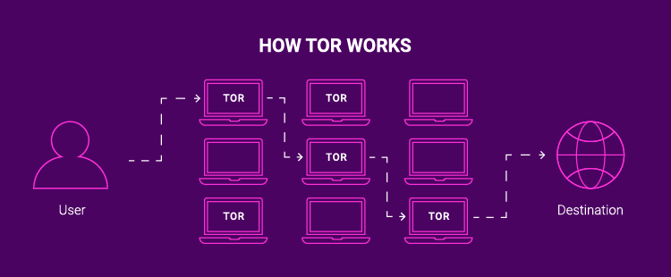

# Tor-Addr 🚩

Liste des ips de tor sur Github: [clique ici](https://raw.githubusercontent.com/Urssaf-SecLab/Tor-Addr/main/ips.txt)

# Kesako ?
Le réseau Tor est un réseau décentralisé qui permet aux utilisateurs de naviguer sur Internet de manière anonyme. Cependant, bien que cet outil soit très utile pour les utilisateurs qui cherchent à préserver leur vie privée, il peut poser des problèmes de sécurité pour les entreprises.

# Dans le détail
En effet, bloquer les adresses IP Tor sur les infrastructures d'une entreprise peut être une mesure de sécurité importante pour éviter les cyberattaques. Les adresses IP Tor sont souvent utilisées pour dissimuler l'identité des utilisateurs, ce qui peut rendre plus difficile l'identification des personnes qui cherchent à accéder illégalement aux systèmes de l'entreprise.

En bloquant les adresses IP Tor, les entreprises peuvent mieux contrôler l'accès à leurs réseaux et identifier plus facilement les utilisateurs qui tentent de se connecter de manière malveillante. Cette mesure peut également permettre de réduire le risque d'attaques par déni de service (DDoS), car les attaquants utilisant le réseau Tor peuvent facilement générer un grand nombre de requêtes sans être détectés.

En somme, bloquer les adresses IP Tor sur les infrastructures d'une entreprise peut être une mesure de sécurité importante pour protéger les systèmes de l'entreprise contre les cyberattaques et réduire les risques de fuite de données. Bien sûr, il est important de considérer également les impacts sur la confidentialité et la liberté d'accès à l'information avant de prendre une telle décision.

# Read More

English translated 🇬🇧/🇺🇸

# Kesako?
The Tor network is a decentralized network that allows users to browse the Internet anonymously. However, while this tool is very useful for users seeking to preserve their privacy, it can pose security problems for businesses.

# In detail
Blocking Tor IP addresses on a company’s infrastructure can be an important security measure to avoid cyber attacks. Tor IP addresses are often used to conceal the identity of users, which can make it more difficult to identify individuals seeking illegal access to the company’s systems.

By blocking Tor IP addresses, companies can better control access to their networks and more easily identify users who try to connect maliciously. This can also reduce the risk of denial of service (DDoS) attacks, as attackers using the Tor network can easily generate a large number of queries without being detected.

In short, blocking Tor IP addresses on a company’s infrastructure can be an important security measure to protect company systems from cyber attacks and reduce the risk of data leaks. Of course, it is important to also consider the impact on confidentiality and freedom of access to information before making such a decision.

